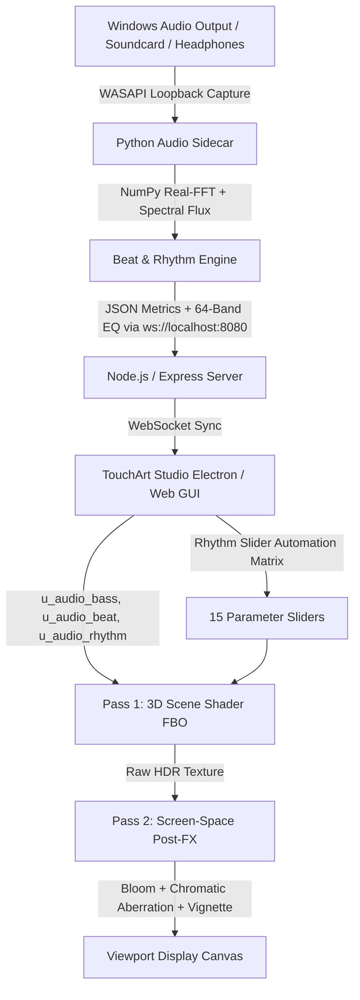

# TouchArt Studio (TouchDesigner Free Alternative) & Cables.gl Live Audio Engine

[](LICENSE)
[](https://nodejs.org/)
[](https://www.python.org/)
[](https://www.khronos.org/webgl/)
[](.github/workflows/ci.yml)

> **TouchArt Studio** is a free, open-source TouchDesigner alternative and high-performance live visual synthesizer. It pairs hardware-accelerated 3D WebGL2 GLSL code art shaders with a bit-perfect **Python WASAPI Windows soundcard loopback engine** and real-time **multi-band spectral flux beat detection**.

Repository: [https://github.com/Mrswami/cables.git](https://github.com/Mrswami/cables.git)

---

## 🎯 What This Project Accomplishes

1. **Bit-Perfect Live Audio Capture (Headphones & Soundcard)**:
   - Captures whatever audio is playing directly on Windows (Spotify, YouTube, Ableton, DAW, games, media players) via native **WASAPI Loopback** (`PyAudioWPatch`).
   - Completely bypasses room microphone bleed and browser permission restrictions.

2. **Ultra-Low Latency Spectral Flux Beat Detection (<10ms)**:
   - Uses multi-band half-wave rectified spectral flux with adaptive statistical thresholding (`mean + k * std`).
   - Emits instantaneous, punchy triggers:
     - `💥 Kick / Sub-Bass Beat` (0.0 to 1.0 transient impact)
     - `🥁 Snare / Mid-Range Onset`
     - `✨ Hi-Hat / High-Treble Transients`
     - `🌊 RMS Energy Dynamic Follower`
     - `🔄 Audio-Synced LFOs` (Sine and Sawtooth waves synchronized to audio tempo)

3. **TouchDesigner-Style Rhythm Slider Automation (Modulation Matrix)**:
   - Modulate any parameter slider (`u_param1` through `u_param10`, plus Post-FX Bloom, Chromatic Aberration, Vignette) directly to incoming beats and rhythm.
   - 4 independent modulation slots with selectable modes:
     - `➕ Add` (additive rhythmic bounce)
     - `🔻 Duck` (sidechain compression dip)
     - `🎯 Direct` (direct signal track)
   - Visual feedback: physical slider thumbs visibly dance in real time on the screen with glowing `<span class="badge-auto">⚡ AUTO</span>` badges.
   - Adjusting a slider while automated offsets the base bias point smoothly.

4. **11 High-Impact 3D Shader Presets**:
   - **3D Audio Frequency Terrain Mesh**: A true raymarched cyber mountain canyon where mountain peaks violently erupt to audio bass and transient beats, with undulating mid waves and a pulsing synthwave horizon sun.
   - **Cyber Core Raymarcher**: 3D geometric shape morpher (Sphere $\rightarrow$ Box $\rightarrow$ Octahedron) with surface spikes and matrix duplication.
   - **Neon Synthwave Horizon**: 80s wireframe grid with a reactive synthwave sun and mountain silhouettes.
   - **Mandala Harmonic Wave Field**, **Quantum Fluid Plasma**, **Hyperdimensional Cosmic Wormhole**, **3D Audio Matrix Cube Grid**, **Volumetric Cosmic Nebula**, **Kaleidoscopic Crystal Lattice**, **Raymarched Torus Knot Fractal**, and **Cybernetic Particle Vortex Engine**.

5. **Two-Pass Post-Processing FX Engine**:
   - Screen-space Bloom / Glow Radius
   - Chromatic Aberration with bass-reactive RGB dispersion
   - Vignette darkness
   - Tone mapping & analog Film Grain noise

6. **64-Band Real-Time EQ Visualizer & Debug Monitor**:
   - Smooth 64-band logarithmic frequency spectrum with vertical cyan-to-magenta gradients and top glow caps.
   - Live FPS counter, frame time graph, and audio metric monitors.

7. **Preset Rules Manager**:
   - Save, delete, export, and import custom slider rules and automation routing matrix configurations as JSON.

8. **Enterprise GitHub Actions CI/CD**:
   - Automated GLSL preset linting and syntax validation.
   - Multi-OS Electron build matrix (Ubuntu, Windows, macOS).
   - Server REST API integration tests and release packaging.

---

## 🏗️ Architecture Overview



---

## ⚡ Live GLSL Shader Uniforms

Every preset and custom equation in TouchArt Studio receives the following uniforms every frame:

```glsl
uniform vec2  u_resolution;    // Viewport width & height in pixels
uniform float u_time;          // Elapsed time in seconds

// Audio Ingestion Uniforms
uniform float u_audio_subBass; // Sub-bass energy (0 to ~180Hz)
uniform float u_audio_bass;    // Punchy bass & kick energy (180 to ~750Hz)
uniform float u_audio_mid;     // Mid-range & vocal energy (750 to ~4.2kHz)
uniform float u_audio_treble;  // Treble & hi-hat energy (4.2k to ~17kHz)
uniform float u_audio_rms;     // Root Mean Square overall loudness
uniform float u_audio_peak;    // Peak envelope value
uniform float u_audio_beat;    // Explosive 0.0 to 1.0 kick transient trigger
uniform float u_audio_rhythm;  // Audio-synced continuous rhythm phase clock

// 10 Core Parameter Sliders (0.0 to 1.0)
uniform float u_param1;        // Shape Morph / Mountain Height
uniform float u_param2;        // Detail / Wireframe Density
uniform float u_param3;        // Glow / Color Spectrum Shift
uniform float u_param4;        // Rotation / Flight Speed
uniform float u_param5;        // Repetitiveness / Grid Tiling
uniform float u_param6;        // Zoom / Camera Scale / Roughness
uniform float u_param7;        // Position Offset / Horizon Pitch
uniform float u_param8;        // Secondary Layer / Line Thickness
uniform float u_param9;        // Background Fog / Sun Glow
uniform float u_param10;       // Time Warp & Animation Speed
```

---

## 🚀 Quickstart & Installation

### Prerequisites
- **Node.js**: v18.0.0 or higher
- **Python**: 3.10 or 3.11 with `pip install PyAudioWPatch numpy websockets`

### 1. Clone & Install Dependencies
```bash
git clone https://github.com/Mrswami/cables.git
cd cables
npm install
pip install PyAudioWPatch numpy websockets
```

### 2. Launch TouchArt Studio Desktop App
```bash
npm start
```
*Electron will automatically start the background sync server and launch the native Python WASAPI loopback bridge.*

### 3. Alternative: Run as Web Application
```bash
npm run web
```
- Open `http://localhost:3000/desktop` in your browser.
- In a separate terminal, launch the Python audio companion:
  ```bash
  npm run audio-sidecar
  ```

---

## 📁 Repository Structure

```
Cables/
├── .github/workflows/ci.yml     # Complete GitHub Actions CI/CD pipeline
├── main.js                      # Electron Desktop App main process (auto-spawns services)
├── package.json                 # Project scripts & dependencies
├── desktop/                     # TouchArt Studio GUI & Shaders
│   ├── index.html               # Main workspace layout & controls
│   ├── app.js                   # Application controller, meters & automation matrix
│   ├── shaderEngine.js          # Two-pass WebGL2 shader pipeline & post-FX
│   ├── audioIngest.js           # Multi-device audio ingest & WebSocket sync
│   ├── presetEquations.js       # 11 Curated 3D GLSL code art shader presets
│   └── styles.css               # TouchDesigner-inspired cyber dark theme
├── server/                      # Server & Audio Companion
│   ├── audio_sidecar.py         # Python WASAPI loopback & spectral flux beat detector
│   ├── index.js                 # Express, WebSocket broadcast & OSC sync server
│   └── test-signal.js           # Test audio waveform generator
├── client/                      # Web control dashboard
├── cables-ops/                  # Cables.gl sync integration tools
└── docs/                        # Architecture & sync documentation
```

---

## 📄 License

Distributed under the **MIT License**. See [LICENSE](LICENSE) for details.  
Maintained by [Mrswami](https://github.com/Mrswami/cables.git).
